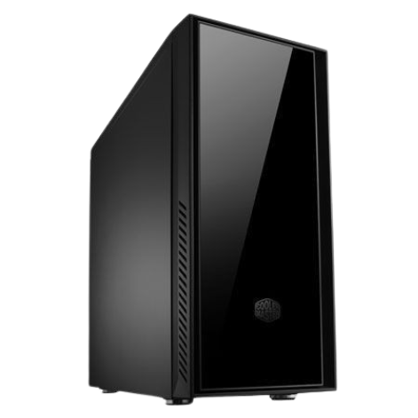
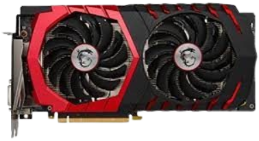
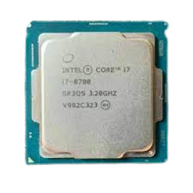
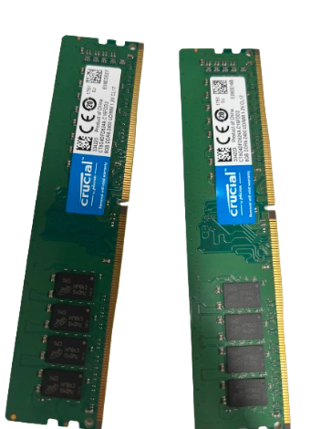
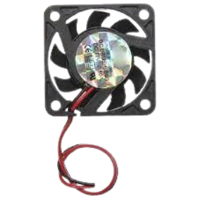
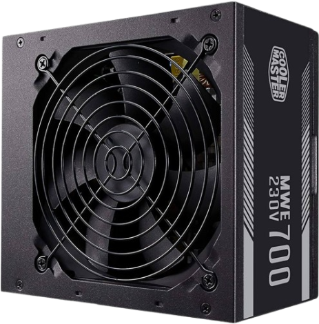
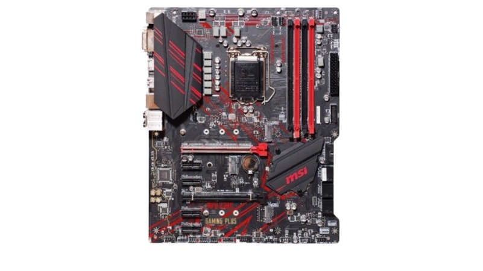
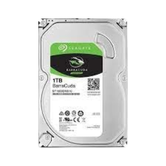

# Les pc d'ynov

## la configue 

**Msi GeForce 1060 GAMING X 6G**
C'est une carte graphique de Nvidia, conçue pour le gaming. Elle a une puissance graphique décente et est capable de gérer des jeux modernes à des résolutions 1080p avec des paramètres graphiques élevés.

**Intel Core i7-8700:**
Il s'agit d'un processeur de la 8e génération d'Intel. Le i7-8700 est une unité centrale puissante, avec six cœurs et douze threads, ce qui en fait une excellente option pour les tâches multitâches et les applications gourmandes en ressources comme la modélisation 3D et le rendu vidéo.

**Crucial 8 Go DDR4 (x2):**
Ce sont des modules de mémoire vive RAM. Avec deux modules de 8 Go chacun, vous avez un total de 16 Go de mémoire RAM DDR4. Cela contribuera à assurer que votre système a suffisamment de mémoire pour exécuter des applications gourmandes en ressources, y compris les jeux modernes.

**Cooler Master DC12V 0.10A (x2):**
Il s'agit probablement de ventilateurs Cooler Master. Ils sont destinés à refroidir le boîtier de votre ordinateur, aidant ainsi à maintenir des températures internes optimales.

**CoolerMaster ATX 770W - ATX 12V V2.52:**
C'est votre bloc d'alimentation. Il fournit l'énergie nécessaire à tous les composants de votre système. Une alimentation de 770W devrait être plus que suffisante pour alimenter votre configuration.

**MSI MPG Z390 Gaming Plus:**
C'est une carte mère de MSI basée sur le chipset Z390 d'Intel. Elle offre un support pour les processeurs Intel Core de 8e et 9e génération, ainsi que d'autres fonctionnalités comme le support pour la mémoire RAM DDR4, les cartes graphiques PCIe, les périphériques de stockage SATA, etc.

**Seagate Barracuda ST1000DM010:**
C'est un disque dur de 1 To de Seagate. Il sert de périphérique de stockage principal pour vos données, y compris le système d'exploitation, les jeux, et d'autres fichiers.

## C'est quoi qu'on peut faire avec ? 🤷‍♂️

**Performance de Jeu au Top 🚀**

Avec la combinaison de la GeForce GTX 1060 et du processeur Intel Core i7-8700, ce PC offre une expérience de jeu exceptionnelle. Des jeux exigeants comme **Rainbow Six Siege** et **Fortnite** tourneront de manière fluide en 1080p avec des paramètres élevés. La GTX 1060, reconnue pour son équilibre entre performance et coût, assure des graphismes de qualité pour une immersion totale.

**The Witcher 3: Wild Hunt comme au Cinéma 🎮:**

Plongez dans l'univers épique de **The Witcher 3: Wild Hunt** avec une qualité visuelle exceptionnelle. La GTX 1060 mettra en valeur chaque détail du monde ouvert, des paysages magnifiques aux créatures fantastiques. Grâce à l'Intel Core i7-8700 et ses six cœurs, le jeu sera fluide, même dans les moments les plus intenses.

Que ce soit pour les stratégies tendues de Rainbow Six Siege, les fusillades endiablées de Fortnite, ou l'exploration captivante de The Witcher 3: Wild Hunt, ce PC est prêt à vous offrir des performances de jeu de haute volée. Plongez dans l'action et profitez de chaque instant, car cette machine est votre billet pour le monde passionnant des jeux modernes. 🚀

## c'est combien qu'il coute ? 💵💵💵💵 

[le boitier: ](https://www.coolermaster.com/catalog/legacy-products/cases/silencio-550/)  119 euros 

[la carte mére: ](https://www.amazon.fr/MSI-B550-Gaming-GEN3-Carte/dp/B09Z2LPMRD/ref=asc_df_B09Z2LPMRD/?tag=googshopfr-21&linkCode=df0&hvadid=603204377992&hvpos=&hvnetw=g&hvrand=301061787223701704&hvpone=&hvptwo=&hvqmt=&hvdev=c&hvdvcmdl=&hvlocint=&hvlocphy=9055289&hvtargid=pla-1733145156705&psc=1&mcid=200e754790d03cd99c7b8764de09cbc3) 114 euros  

[le hdd : ](https://www.ebay.fr/itm/256363665765?chn=ps&norover=1&mkevt=1&mkrid=709-134431-41854-0&mkcid=2&mkscid=101&itemid=256363665765&targetid=1598368561399&device=c&mktype=pla&googleloc=9055289&poi=&campaignid=20841691198&mkgroupid=156215475053&rlsatarget=pla-1598368561399&abcId=9351429&merchantid=6995724&gclid=CjwKCAiAkp6tBhB5EiwANTCx1GnDyNI1sYw4Q3Mo8N41a5dh8irnqrXnP5DtsbruuJ7IFC6Q9bBL6xoCLowQAvD_BwE)
18.99 euros

[les ventilo: ](https://fr.aliexpress.com/item/4001233582509.html?src=google&src=google&albch=shopping&acnt=248-630-5778&slnk=&plac=&mtctp=&albbt=Google_7_shopping&gclsrc=aw.ds&albagn=888888&isSmbAutoCall=false&needSmbHouyi=false&src=google&albch=shopping&acnt=248-630-5778&slnk=&plac=&mtctp=&albbt=Google_7_shopping&gclsrc=aw.ds&albagn=888888&ds_e_adid=&ds_e_matchtype=&ds_e_device=c&ds_e_network=x&ds_e_product_group_id=&ds_e_product_id=fr4001233582509&ds_e_product_merchant_id=107900354&ds_e_product_country=FR&ds_e_product_language=fr&ds_e_product_channel=online&ds_e_product_store_id=&ds_url_v=2&albcp=20497291105&albag=&isSmbAutoCall=false&needSmbHouyi=false&gad_source=1&gclid=CjwKCAiAkp6tBhB5EiwANTCx1OcPw_f0sLFR_m0-k1InpV1onIcZUaqhnjC9NLEf0Q_wkV-Uj_SOChoCJeYQAvD_BwE&aff_fcid=0ae94b1beee84ffbaac999cb6b6adbec-1705499855452-05695-UneMJZVf&aff_fsk=UneMJZVf&aff_platform=aaf&sk=UneMJZVf&aff_trace_key=0ae94b1beee84ffbaac999cb6b6adbec-1705499855452-05695-UneMJZVf&terminal_id=b2f92a08f30e402fab34f7d4fe3eee83&afSmartRedirect=y) 10,80 euros

[l'alimentation](https://www.ebay.fr/itm/186250170906?chn=ps&norover=1&mkevt=1&mkrid=709-134431-41854-0&mkcid=2&mkscid=101&itemid=186250170906&targetid=1654254362536&device=c&mktype=pla&googleloc=9055289&poi=&campaignid=20841691198&mkgroupid=156215475053&rlsatarget=pla-1654254362536&abcId=9351429&merchantid=6995724&gclid=CjwKCAiAkp6tBhB5EiwANTCx1ByRPosVFrYgaLZlvEB9t9mJg1jwyedmEYJlkyPbhGOssIB217Y3XBoCfBgQAvD_BwE) 54,90euros  

[La ram ](https://www.crucial.fr/memory/ddr4/ct8g4dfs824a?gclid=CjwKCAiAkp6tBhB5EiwANTCx1JivdcfeEYKFqD09GEa2rlJ2-MjJFGQpAQkDYGXUlk4MQUDvl8hIwxoCDA0QAvD_BwE&cm_mmc=google-_-fr-_-brand-_-pmax&gclsrc=aw.ds&gad_source=1&ef_id=ZPLgHQANLkyE9wA_:20240117140434:s) 60 euros les deux

[la carte graphique :](https://www.ebay.fr/itm/305134715903?chn=ps&norover=1&mkevt=1&mkrid=709134431418540&mkcid=2&mkscid=101&itemid=305134715903&targetid=1929305285906&device=c&mktype=pla&googleloc=9055302&poi=&campaignid=19258660964&mkgroupid=144675992779&rlsatarget=pla-1929305285906&abcId=9304149&merchantid=6995724&gclid=CjwKCAiAkp6tBhB5EiwANTCx1FLQm8frRNwnMCDnuLpUlo6j7z2r7SHQKrCPfFK2FaTlmrwbJ9hMXBoCsbAQAvD_BwE) 100 euros

[le proco :](https://fr.shopping.rakuten.com/offer/buy/2423088913/intel-core-i7-8700-3-2-ghz.html?fbbaid=15266854563&t=180188&gad_source=1) 200 euros

Tout ca pour un totale de 677.69 euros 

grp: hugo chamand nicolas prigent Salma Fakhar
